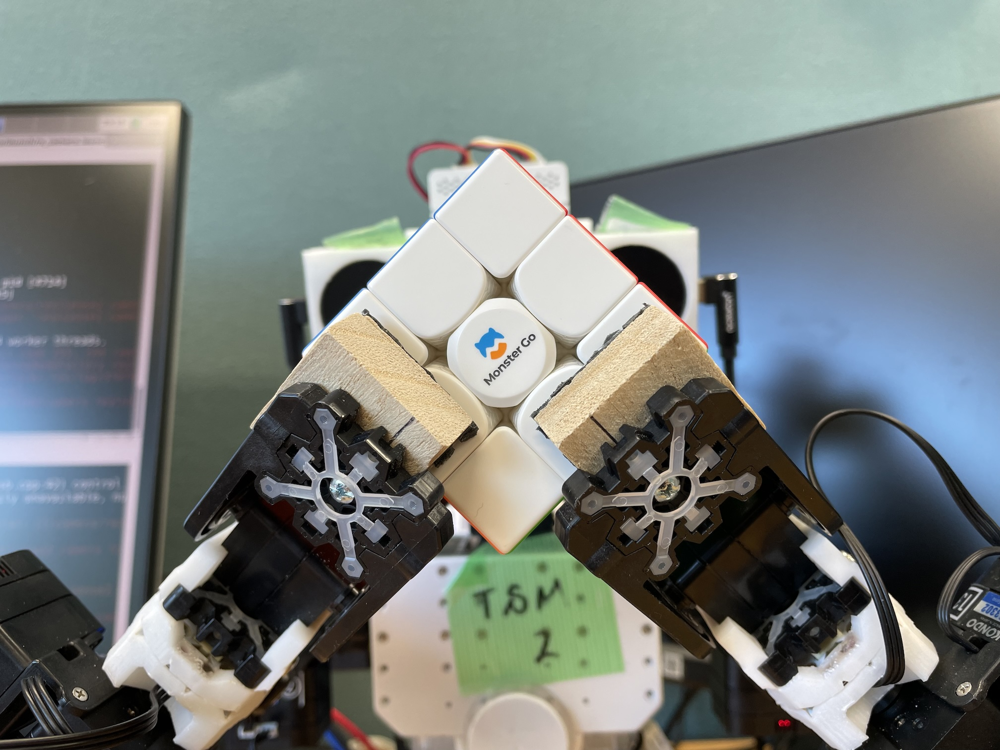

2024年3月20日に行われた東京大学稲葉雅幸教授の最終講義第1部（JSK OB・OG会）用に作成した、KXRでルービックキューブを解くデモのプログラム等をまとめたレポジトリです。
[](https://youtu.be/CVYYmKJGDNQ)


# KXRの改造
## グリッパ取付角度の変更
ニュートラル姿勢で下図のような向きになるようにグリッパの取付を90度変更します。


## グリッパ先端形状の変更
[こちら](https://www.tinkercad.com/things/biUti9bAgkf-kxr-fingertip?sharecode=K93nFpG1A8HCsEcW_OjZFT_ij9SFqgD5Zj6hoSePQXw)の形状を3Dプリンタなどで出力し、指先に取り付けます。


[ダイソーのすべり止めシート](https://jp.daisonet.com/collections/living0223/products/4940921833423)を指先のサイズに合わせてカットし、両面テープで貼り付けます。


# ルービックキューブ
一辺が56mmの3x3ルービックキューブを用います。軽い力で回転させることが可能な[MonsterGo社のMG3x3](https://www.amazon.co.jp/gp/product/B0B67PYMHB/ref=ppx_yo_dt_b_asin_title_o03_s00?ie=UTF8&th=1)を使用しました。色認識もこのルービックキューブに合わせて調整しています。

# インストール
JSK環境がインストールされたDebian10が前提です。
```
$ pip3 install kociemba
$ cd <catkin workspace>/src
$ git clone git@github.com:fkanehiro/kxr_cube_solver
$ cd ..
$ catkin build
```
# 初期設定

ターミナルを3つ用意し、それぞれ以下のコマンドを実行します。
```
terminal1$ roslaunch realsense2_camera rs_camera.launch color_width:=848 color_height:=480
terminal2$ roslaunch kxr_cube_solver cubeSolver.launch
terminal3$ cd ~/rcb4eus
terminal3$ roseus <catkin_workspace>/src/kxr_cube_solver/euslisp/cubeSolver.l __name:=roseus_command_server
```
画像処理結果を表示するウィンドウが開き、KXRのサーボがONになり、初期姿勢に移行しながら、「ルービックキューブを手の上においてください」としゃべります。

KXRの個体差を吸収するため、euslisp/cubeSolver.lのinit-pose関数で指定している関節の角度を調整し、下図のように把持できるようにしてください。手首を捻る回転軸がルービックキューブの中心を通るようにすること、グリッパの先端がルービックキューブと並行になることが必要です。



また、画像処理結果を表示しているウィンドウの中央付近に表示されている9つの四角がおおよそ各ブロックの位置に来るように首の角度や肩の角度を調整してください。


ウィンドウの左上には現在の認識結果が表示されます（左手で把持している面が下）。指で隠れているブロック以外のブロックの色が正しく認識されることを確認してください。色が異なるルービックキューブを使う場合には、script/vision.pyの色の定義を変更する必要があります。マウスカーソルの位置にあるピクセルのRGB値がウィンドウ左下に表示されるので、その値を転記することで調整できます。

# 実行方法
上の初期設定と同じ手順でプログラムを起動します。
ルービックキューブを手の上に置きaキーを押すとルービックキューブを見回した後解き始めます。解き終わると最初の状態に戻るので、ルービックキューブを取って状態を変えて置き、aキーを押す、という流れを繰り返すことができます。

背景が暗すぎたり、明るすぎたりするとホワイトバランスの関係で色認識に失敗する場合があります。


## キー操作
画像処理結果を表示しているウィンドウの上でキーを押すことで以下の操作ができます。
- a 状態遷移の自動・手動をトグルで切り替えます。
- n 状態遷移が手動になっている際に次の状態に遷移させます。
- e ルービックキューブを見る動作または解く動作を中断し、init-pose姿勢に戻ります。ルービックキューブの把持状態がずれてしまった場合などに用います。
- x neutral姿勢に移行し、サーボをOFFにします。
# 参考
- https://github.com/muodov/kociemba
- https://github.com/kkoomen/qbr
- https://www.thingiverse.com/thing:3826740
   
